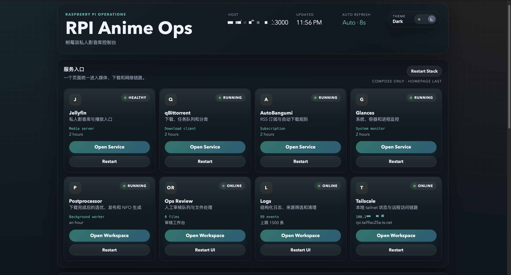
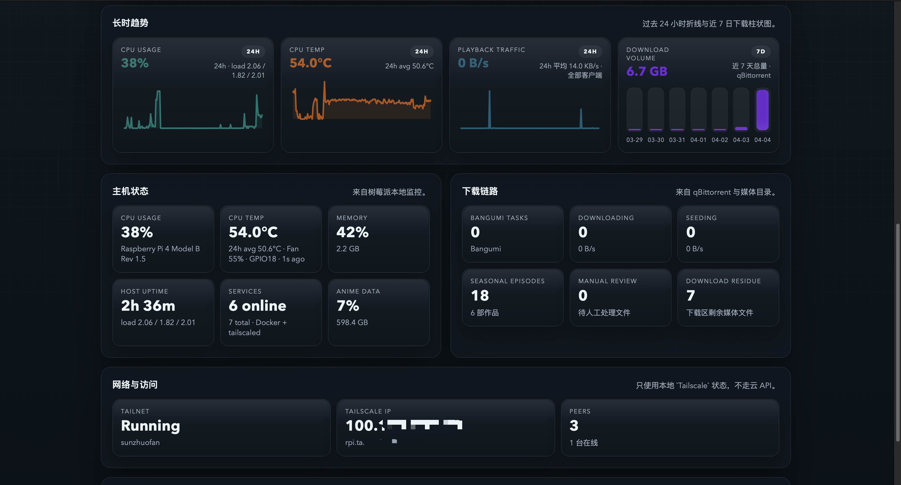
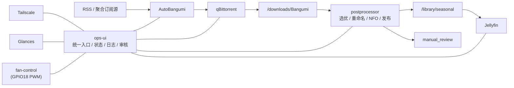

# RPI Anime

树莓派上的自用番剧库与运维控制台开发记录。

这个项目把番剧订阅、下载、选优入库、播放、异地访问和运维界面串成了一条完整链路。核心思路是：外部服务尽量复用成熟组件，真正和“自用追番”强相关的部分自己写，比如下载后选优、重命名、NFO 生成、人工审核和统一运维入口。

前端和运维界面的重构方向见：

- [Ops UI Redesign Spec](/Users/sunzhuofan/RPI_Anime/docs/superpowers/specs/2026-04-07-ops-ui-redesign-design.md)
- [Ops UI Phase 2 Foundation Plan](/Users/sunzhuofan/RPI_Anime/docs/superpowers/plans/2026-04-07-ops-ui-phase-2-foundation.md)

## 这套项目解决什么问题

- 聚合 RSS 订阅后，自动把新番送进下载器。
- 同一集有多个字幕组或多个版本时，自动选 1 个保留，避免重复入库。
- 下载区、媒体库、人工审核区职责分离，不让播放器直接面对脏数据。
- 通过 `ops-ui` 把媒体服务、下载器、Tailscale 和内部工具统一收口到一个入口。
- 通过 `Tailscale` 在不同网络环境下访问，不额外暴露公网端口。
- 在宿主机上单独控制风扇，不依赖容器。

## 当前实现

- 聚合 RSS -> [AutoBangumi](https://www.autobangumi.org/) -> [qBittorrent](https://github.com/qbittorrent/qBittorrent) -> 自定义 `postprocessor` -> [Jellyfin](https://github.com/jellyfin/jellyfin)
- 下载完成后自动选优、发布到 `Seasonal` 媒体库，并生成 `tvshow.nfo` 和分集 `.nfo`
- 识别失败或不适合自动入库的内容进入 `manual_review`
- 自定义 `ops-ui` 提供统一入口、趋势图、日志、人工审核页、Tailscale 页面和 Postprocessor 页面
- 宿主机通过 [Tailscale](https://tailscale.com/) 负责跨网络访问，通过 [Glances](https://github.com/nicolargo/glances) 提供系统指标
- 风扇通过宿主机 `systemd + pigpiod` 做 PWM 控速

## 前端结构

`ops-ui` 当前已经整理成四层：

- `FastAPI` 路由与页面装配：
  负责 API、页面路由和共享页面上下文
- `services/*` 后端聚合层：
  负责把 `Logs`、`Ops Review`、`Postprocessor`、`Tailscale` 和首页概览的聚合逻辑从路由层剥离出来
- `Jinja` 共享 shell：
  内部工作页共用一套页面骨架、导航和主题入口
- `static/` 前端层：
  `core.js` 提供共享 bootstrap、缓存和查询参数工具；页面脚本只处理自己的数据请求与渲染；样式拆成 `tokens / base / layout / components / pages`

后续大改方向以 spec 和 plan 为准。

## 界面预览

首页上半部分，主要是统一入口和服务状态：



首页下半部分，主要是趋势、主机状态、下载链路、网络访问和诊断：



## 外部服务

- [Jellyfin](https://github.com/jellyfin/jellyfin): 媒体库展示、播放和用户界面
- [qBittorrent](https://github.com/qbittorrent/qBittorrent): 下载器、分类和队列管理
- [AutoBangumi](https://www.autobangumi.org/): RSS 订阅、规则生成和番剧识别入口
- [Tailscale](https://tailscale.com/): 异地访问和 tailnet 组网
- [Glances](https://github.com/nicolargo/glances): 系统状态采集

## 工作流



## 组件职责

| 组件 | 职责 | 运行位置 |
| --- | --- | --- |
| `ops-ui` | 首页、趋势、日志、Tailscale 页面、Postprocessor 页面、人工审核页 | Docker |
| [Jellyfin](https://github.com/jellyfin/jellyfin) | 播放器、媒体库和元数据展示 | Docker |
| [qBittorrent](https://github.com/qbittorrent/qBittorrent) | 实际下载器，负责种子任务和分类 | Docker |
| [AutoBangumi](https://www.autobangumi.org/) | RSS 解析、番剧订阅和下发下载任务 | Docker |
| `postprocessor` | 下载完成后的选优、发布、NFO 生成、人工审核分流 | Docker |
| [Glances](https://github.com/nicolargo/glances) | 采集 CPU、内存、温度和系统状态 | Docker |
| [Tailscale](https://tailscale.com/) | tailnet 访问，不走公网端口暴露 | 宿主机 |
| `anime-fan-control` | 按 CPU 温度调节风扇占空比 | 宿主机 |

## 运行目录

| 路径 | 用途 |
| --- | --- |
| `/srv/anime-data/downloads` | 下载区，`qBittorrent` 实际写入位置 |
| `/srv/anime-data/library/seasonal` | 季度追番自动入库区 |
| `/srv/anime-collection` | 收藏库，只读挂给 Jellyfin |
| `/srv/anime-data/processing/manual_review` | 人工审核区 |
| `/srv/anime-data/appdata` | 各服务配置、数据库和状态文件 |
| `/srv/anime-data/appdata/rpi-anime` | 本仓库同步到树莓派后的项目目录 |

## 仓库结构

```text
.
├── deploy
│   ├── .env.example
│   ├── compose.yaml
│   ├── fan_control.toml
│   ├── systemd
│   └── title_mappings.toml
├── docs
│   ├── dash1.png
│   ├── dash2.png
│   ├── superpowers
│   │   ├── plans
│   │   └── specs
├── scripts
│   ├── bootstrap_pi.sh
│   ├── install_tailscale_pi.sh
│   ├── install_fan_control_pi.sh
│   ├── tailscale_control_pi.sh
│   ├── tailscale_rebuild_pi.sh
│   ├── remote_tailscale.sh
│   ├── remote_up.sh
│   ├── sync_to_pi.sh
│   ├── fan_control.py
│   └── fan_pwm_test.py
└── services
    ├── ops_ui
    │   └── src
    │       └── anime_ops_ui
    │           ├── services
    │           ├── static
    │           │   ├── core.js
    │           │   ├── theme.js
    │           │   ├── styles.css
    │           │   └── styles
    │           └── templates
    └── postprocessor
```

## 访问入口

`ops-ui` 会按你当前打开页面的地址生成入口链接，所以无论你是从 `.local`、Tailscale IP 还是 MagicDNS 访问首页，外部服务按钮都会跳到同一条访问链路。

默认端口如下：

| 服务 | 端口 |
| --- | --- |
| `ops-ui` | `3000` |
| `Jellyfin` | `8096` |
| `qBittorrent` | `8080` |
| `AutoBangumi` | `7892` |
| `Glances` | `61208` |

---

## 部署

下面这套流程只基于本仓库现有脚本和目录结构。

### 1. 准备树莓派和存储

- 安装 `Raspberry Pi OS (64-bit)`
- 准备外置 SSD
- 约定好这两个挂载点：
  - `/srv/anime-data`
  - `/srv/anime-collection`

建议：

- `/srv/anime-data` 放下载区、媒体库、`appdata`
- `/srv/anime-collection` 放收藏库
- 系统盘和服务配置分离，避免媒体数据落到 SD 卡

### 2. 本地准备配置

在本地仓库里复制环境文件：

```bash
cp deploy/.env.example deploy/.env
```

至少先改这些值：

- `PI_HOST`
- `PI_REMOTE_USER`
- `PI_REMOTE_ROOT`
- `QBITTORRENT_USERNAME`
- `QBITTORRENT_PASSWORD`
- `TZ`

### 3. 第一次同步项目到树莓派

```bash
./scripts/sync_to_pi.sh
```

这一步会：

- 创建远端项目目录
- 同步仓库内容
- 如果本地存在 `deploy/.env`，也会单独同步过去

### 4. 在树莓派安装 Docker 和准备目录

SSH 到树莓派后执行：

```bash
cd /srv/anime-data/appdata/rpi-anime
./scripts/bootstrap_pi.sh
```

这一步会：

- 安装 Docker Engine 和 Compose plugin
- 创建下载区、媒体库、缓存、人工审核区
- 把运行目录权限交给普通用户
- 把当前用户加入 `docker` 组

### 5. 启动基础服务

回到本地执行：

```bash
./scripts/remote_up.sh
```

或者直接在树莓派上执行：

```bash
cd /srv/anime-data/appdata/rpi-anime
docker compose --env-file deploy/.env -f deploy/compose.yaml up -d
```

### 6. 安装 Tailscale

在树莓派上执行：

```bash
cd /srv/anime-data/appdata/rpi-anime
./scripts/install_tailscale_pi.sh
```

安装完以后完成登录授权：

```bash
./scripts/tailscale_control_pi.sh start
./scripts/tailscale_control_pi.sh login
```

如果只是查看状态：

```bash
./scripts/tailscale_control_pi.sh status
```

### 7. 安装风扇控制

如果 pwm 风扇蓝线接在 `GPIO18`，可以在树莓派上执行：

```bash
cd /srv/anime-data/appdata/rpi-anime
./scripts/install_fan_control_pi.sh
```

它会：

- 安装 `pigpio-tools` 和 `python3-pigpio`
- 启用 `pigpiod`
- 安装并启用宿主机 `anime-fan-control.service`

### 8. 完成第一次 Web 配置

#### Jellyfin

- 添加 `Seasonal` 库 -> `/media/seasonal`
- 添加 `Collection` 库 -> `/media/collection`

#### qBittorrent

- 默认下载路径设为 `/downloads/Bangumi`
- 配置你自己的 WebUI 用户名和密码

#### AutoBangumi

- 下载器指向 `qbittorrent:8080`
- 下载路径填 `/downloads/Bangumi`
- 建议关闭它自己的自动重命名，把命名和发布交给 `postprocessor`

---

## 必要使用方式

### 本地改动后重新同步

```bash
./scripts/sync_to_pi.sh
./scripts/remote_up.sh
```

### 直接在树莓派上查看运行状态

```bash
cd /srv/anime-data/appdata/rpi-anime
docker compose --env-file deploy/.env -f deploy/compose.yaml ps
docker compose --env-file deploy/.env -f deploy/compose.yaml logs -f
```

### 直接在树莓派上启动或更新整套服务

```bash
cd /srv/anime-data/appdata/rpi-anime
docker compose --env-file deploy/.env -f deploy/compose.yaml up -d
```

### 重启单个服务

```bash
cd /srv/anime-data/appdata/rpi-anime
docker compose --env-file deploy/.env -f deploy/compose.yaml restart jellyfin
docker compose --env-file deploy/.env -f deploy/compose.yaml restart qbittorrent
docker compose --env-file deploy/.env -f deploy/compose.yaml restart autobangumi
```

### Tailscale 控制

树莓派宿主机上：

```bash
cd /srv/anime-data/appdata/rpi-anime
./scripts/tailscale_control_pi.sh status
./scripts/tailscale_control_pi.sh start
./scripts/tailscale_control_pi.sh stop
./scripts/tailscale_control_pi.sh login
```

本地直接远程控制：

```bash
./scripts/remote_tailscale.sh status
./scripts/remote_tailscale.sh start
./scripts/remote_tailscale.sh stop
./scripts/remote_tailscale.sh rebuild
```

### 风扇 PWM 测试

```bash
cd /srv/anime-data/appdata/rpi-anime
python3 scripts/fan_pwm_test.py
```

### `ops-ui` 里能做什么

- 打开外部服务：`Jellyfin`、`qBittorrent`、`AutoBangumi`、`Glances`
- 打开内部工作区：`Postprocessor`、`Ops Review`、`Logs`、`Tailscale`
- 查看主机状态、下载链路、长时趋势和诊断
- 重启单个服务或整套 Compose 栈

## 运行说明

- Compose 服务都是 `restart: unless-stopped`
- `tailscaled` 由宿主机 `systemd` 管理
- Docker 日志已经启用 rotation：
  - `max-size=10m`
  - `max-file=3`
- `ops-ui` 会检测 `/srv/anime-data` 和 `/srv/anime-collection` 是否真的挂在外置盘上
  - 如果盘没挂上，首页 `诊断` 会直接报挂载异常

## 项目边界

- 默认目标是自用番剧库，不是多用户公网服务
- 默认目标是尽量 `Direct Play`，不是重度实时转码
- `postprocessor` 负责把下载区整理成播放器可用的媒体库，但不会替代所有元数据插件
