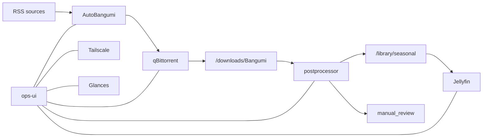

# RPI Anime

[简体中文](./README.zh-Hans.md)

RPI Anime is a personal hobby project for running an RSS-driven media pipeline on a Raspberry Pi.
It started as an anime stack, but the workflow is broad enough for other subscription-based video libraries that arrive through RSS and benefit from download automation, library cleanup, publishing, and playback in one place.

The repository combines off-the-shelf services with a custom control layer:

- [AutoBangumi](https://github.com/EstrellaXD/Auto_Bangumi) for RSS subscriptions and release tracking
- [qBittorrent](https://github.com/qbittorrent/qBittorrent) for download execution
- a custom `postprocessor` for version selection, renaming, publishing, and review fallback
- [Jellyfin](https://github.com/jellyfin/jellyfin) for library browsing and playback
- a custom `ops-ui` for dashboard, review queue, logs, service controls, and weekly broadcast tracking

## What It Does

- Pulls new items from RSS subscriptions into the download queue
- Picks a single winning file when multiple releases exist for the same episode
- Publishes clean files into the library and generates `.nfo` metadata
- Sends uncertain cases into a manual review area instead of polluting the media library
- Exposes the whole workflow through a lightweight operations dashboard
- Supports local network and tailnet access through [Tailscale](https://github.com/tailscale/tailscale)

## Dashboard Snapshot

The current UI focuses on a compact control surface and a weekly broadcast wall.


## Core Workflow



## Main Components

| Component | Role | Runtime |
| --- | --- | --- |
| `ops-ui` | Dashboard, review queue, logs, postprocessor and Tailscale pages | Docker |
| `postprocessor` | File selection, renaming, metadata generation, publish/review split | Docker |
| [Jellyfin](https://github.com/jellyfin/jellyfin) | Media library and playback | Docker |
| [qBittorrent](https://github.com/qbittorrent/qBittorrent) | Download execution and queue management | Docker |
| [AutoBangumi](https://github.com/EstrellaXD/Auto_Bangumi) | RSS subscriptions and bangumi tracking | Docker |
| `Glances` | Host metrics for the dashboard | Docker |
| [Tailscale](https://github.com/tailscale/tailscale) | Remote access without public exposure | Host |
| `anime-fan-control` | PWM fan control tied to host temperature | Host |

## Repository Layout

```text
.
├── deploy/
│   ├── compose.yaml
│   ├── fan_control.toml
│   ├── homepage/
│   ├── systemd/
│   └── title_mappings.toml
├── docs/
│   ├── dash1.png
│   └── dash2.png
├── scripts/
│   ├── bootstrap_pi.sh
│   ├── install_fan_control_pi.sh
│   ├── install_tailscale_pi.sh
│   ├── remote_up.sh
│   └── sync_to_pi.sh
└── services/
    ├── ops_ui/
    └── postprocessor/
```

## Notes

- The weekly `Broadcast Wall` is driven by AutoBangumi data and highlights shows that were added to the library during the current week.
- Broadcast wall posters can open the matching Jellyfin series page directly.
- `ops-ui` supports both `zh-Hans` and `en`.
- The repository intentionally keeps public-facing documentation lightweight; internal planning scratch files are not part of the tracked docs set.

## Deployment Flow

### 1. Prepare the Raspberry Pi

Use a Raspberry Pi running 64-bit Raspberry Pi OS and prepare these mount points:

- `/srv/anime-data`
- `/srv/anime-collection`

Then bootstrap Docker and the default runtime directories:

```bash
./scripts/bootstrap_pi.sh
```

Optional host-side setup:

```bash
./scripts/install_tailscale_pi.sh
./scripts/install_fan_control_pi.sh
```

### 2. Create local deployment config

Create `deploy/.env` locally and fill in at least:

- `PI_HOST`
- `PI_REMOTE_USER`
- `PI_REMOTE_ROOT`
- `TZ`
- `QBITTORRENT_USERNAME`
- `QBITTORRENT_PASSWORD`
- `AUTOBANGUMI_USERNAME`
- `AUTOBANGUMI_PASSWORD`

### 3. Sync the repository to the Pi

```bash
./scripts/sync_to_pi.sh
```

This copies the repo to `${PI_REMOTE_ROOT}` and syncs `deploy/.env` separately.

### 4. Build and start services

```bash
./scripts/remote_up.sh
```

This rebuilds `homepage`, refreshes `postprocessor`, and brings the full compose stack up.

### 5. Verify the deployment

Typical checks:

```bash
curl http://<ops-host>:3000/healthz
curl http://<ops-host>:3000/api/overview
```

For later updates, the usual flow is simply:

```bash
./scripts/sync_to_pi.sh
./scripts/remote_up.sh
```
