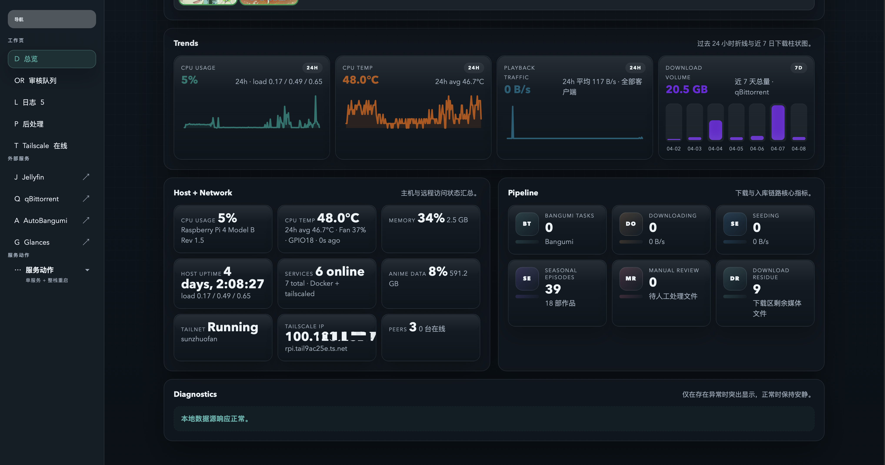
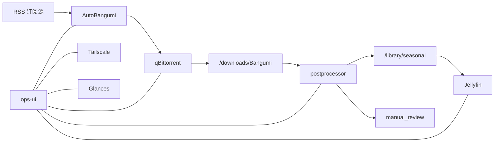

# RPI Anime

[English](./README.md)

`RPI Anime` 是一个运行在树莓派上的个人兴趣项目，核心目标是把基于 RSS 订阅的影音内容接入一条完整的自动化链路。
它最初围绕追番场景搭建，但整体流程并不只适合动画，任何能通过 RSS 进入下载、整理、入库、播放流程的影音内容都可以套用这套结构。

这个仓库把现成服务和自定义逻辑拼成一套完整系统：

- [AutoBangumi](https://github.com/EstrellaXD/Auto_Bangumi) 负责 RSS 订阅和放送跟踪
- [qBittorrent](https://github.com/qbittorrent/qBittorrent) 负责下载执行
- 自定义 `postprocessor` 负责选优、重命名、发布和人工审核分流
- [Jellyfin](https://github.com/jellyfin/jellyfin) 负责媒体库和播放
- 自定义 `ops-ui` 负责总览、审核队列、日志、服务控制和周放送表

## [石墩子](https://github.com/professor-lee/StoneBadge/tree/main)


## 这个项目在做什么

- 从 RSS 订阅把新内容送进下载队列
- 同一集有多个版本时自动挑出一个保留版本
- 把干净文件发布进媒体库，并生成 `.nfo` 元数据
- 识别不稳或不适合自动入库的内容进入人工审核区
- 通过一个轻量化运维界面统一查看整条链路
- 结合 [Tailscale](https://github.com/tailscale/tailscale) 提供局域网外访问能力

## 界面概览

当前界面重点是紧凑控制台和首页周放送表。




## 核心工作流



## 主要组件

| 组件 | 作用 | 运行位置 |
| --- | --- | --- |
| `ops-ui` | 总览、审核队列、日志、Postprocessor 和 Tailscale 页面 | Docker |
| `postprocessor` | 选优、重命名、元数据生成、发布/审核分流 | Docker |
| [Jellyfin](https://github.com/jellyfin/jellyfin) | 媒体库和播放 | Docker |
| [qBittorrent](https://github.com/qbittorrent/qBittorrent) | 下载执行和队列管理 | Docker |
| [AutoBangumi](https://github.com/EstrellaXD/Auto_Bangumi) | RSS 订阅和番剧跟踪 | Docker |
| `Glances` | 给 dashboard 提供宿主机指标 | Docker |
| [Tailscale](https://github.com/tailscale/tailscale) | 不暴露公网端口的远程访问 | 宿主机 |
| `anime-fan-control` | 随温度调节的 PWM 风扇控制 | 宿主机 |

## 仓库结构

```text
.
├── deploy/
│   ├── compose.yaml
│   ├── fan_control.toml
│   ├── homepage/
│   ├── systemd/
│   └── title_mappings.toml
├── docs/
│   ├── dash1.png
│   └── dash2.png
├── scripts/
│   ├── bootstrap_pi.sh
│   ├── install_fan_control_pi.sh
│   ├── install_tailscale_pi.sh
│   ├── remote_up.sh
│   └── sync_to_pi.sh
└── services/
    ├── ops_ui/
    └── postprocessor/
```

## 说明

- 首页 `Broadcast Wall` 以 AutoBangumi 为主数据源，并高亮“本周已入库”的条目。
- 周放送表里的 poster 可以直接跳到对应的 Jellyfin 剧集页。
- `ops-ui` 目前支持 `zh-Hans` 和 `en` 两种语言。
- 仓库里的公开文档只保留长期有用的说明，阶段性计划和本地草稿不再作为受控文档保留。

## 部署流程

### 1. 准备树莓派环境

建议使用 64 位 Raspberry Pi OS，并提前准备好这两个挂载点：

- `/srv/anime-data`
- `/srv/anime-collection`

存储注意事项：

- 这两个路径应该指向预期的外置数据盘，而不是系统盘上的空目录。
- `./scripts/sync_to_pi.sh` 现在会检查树莓派上的实际挂载来源；如果 `/etc/fstab` 里声明了挂载，但目标路径已经回落到 `/`，脚本会直接拒绝同步，避免误写入 SD 卡。
- 可以在树莓派上用这些命令快速核对：

```bash
lsblk -o NAME,MODEL,SIZE,FSTYPE,MOUNTPOINTS,LABEL,UUID
findmnt /srv/anime-data /srv/anime-collection
df -h /srv/anime-data /srv/anime-collection
```

- 如果你使用的是 SanDisk `Extreme 55AE`，并且在树莓派上反复遇到 UAS 掉盘，可以在 `/boot/firmware/cmdline.txt` 追加 `usb-storage.quirks=0781:55ae:u` 后重启。

然后执行基础引导脚本：

```bash
./scripts/bootstrap_pi.sh
```

如果需要宿主机侧能力，可以继续执行：

```bash
./scripts/install_tailscale_pi.sh
./scripts/install_fan_control_pi.sh
```

### 2. 在本地准备部署配置

在本地创建 `deploy/.env`，至少填写这些值：

- `PI_HOST`
- `PI_REMOTE_USER`
- `PI_REMOTE_ROOT`
- `TZ`
- `QBITTORRENT_USERNAME`
- `QBITTORRENT_PASSWORD`
- `AUTOBANGUMI_USERNAME`
- `AUTOBANGUMI_PASSWORD`

### 3. 同步仓库到树莓派

```bash
./scripts/sync_to_pi.sh
```

这个脚本会把仓库同步到 `${PI_REMOTE_ROOT}`，单独同步 `deploy/.env`，并在 `deploy/compose.yaml`、服务构建输入或 `deploy/.env` 变化时自动对远端 compose 栈做一次对齐。

### 4. 构建并启动服务

```bash
./scripts/remote_up.sh
```

这个脚本仍然保留为“显式整栈重建”入口，适合你想强制刷新整套 compose 服务时使用。

### 5. 验证部署结果

常用检查方式：

```bash
curl http://<ops-host>:3000/healthz
curl http://<ops-host>:3000/api/overview
```

后续更新通常先执行：

```bash
./scripts/sync_to_pi.sh
```

如果你明确想做一次整栈重建，再执行 `./scripts/remote_up.sh`。
