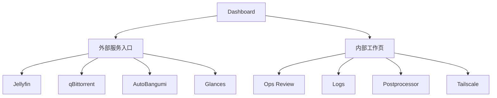

# Ops UI Frontend Refactor

这份文档描述 `services/ops_ui` 当前前端层的设计目标、结构边界和后续演进方式。目标不是“把页面做得更花”，而是在保留现有全部功能的前提下，把这套运维界面整理成一个更稳、更快、更容易继续维护的前端。

## 目标

- 保留现有功能：
  - 首页总览
  - `Ops Review`
  - `Logs`
  - `Postprocessor`
  - `Tailscale`
  - 外部服务跳转
  - 单服务重启 / 整套重启
- 降低前端重复代码，避免每个页面各写一套工具函数。
- 保持树莓派可接受的性能开销，不引入重型前端框架。
- 让页面在 `.local`、`Tailscale IP`、`MagicDNS` 这几条访问链路下都能稳定打开。
- 为后续中英切换、页面再设计和样式拆分打基础。

## 视觉方向

### Visual Thesis

这套界面不是“仪表盘秀场”，而是一个安静、克制、偏专业的运维工作台：深浅主题都以低噪声表面、清楚的状态对比和稳定的数字信息为核心。

### Content Plan

- 首页：入口、趋势、主机状态、下载链路、网络与诊断
- 内部页：围绕单一任务展开，不做首页那种“总览拼盘”
- 详情页：把动作、上下文、结果放在一个工作流里，不让用户频繁迷路

### Interaction Thesis

- 首屏先有骨架和缓存，再异步刷新，不让页面先空半秒
- 自动刷新服务于监控，不打断用户输入和手动操作
- 外部服务新标签页打开，内部工具页走站内多页面

## 页面职责



- `Dashboard`：统一入口和跨页面总览
- `Ops Review`：人工审核列表、详情与受控动作
- `Logs`：结构化事件流
- `Postprocessor`：只读运行态与命令入口
- `Tailscale`：tailnet 状态与 peer 视图

## 前端结构

当前前端是**轻量多页面应用**，不是 SPA。

### 为什么不做 SPA

- 页面数量不多，信息边界清楚
- 运维界面更看重首屏快和结构简单
- 树莓派部署下，静态页面 + 少量 JS 更稳
- 每页职责明确时，多页面比全局状态管理更容易维护

### 目录

```text
services/ops_ui/src/anime_ops_ui/static
├── index.html
├── ops-review.html
├── ops-review-item.html
├── logs.html
├── postprocessor.html
├── tailscale.html
├── app.js
├── ops-review.js
├── ops-review-item.js
├── logs.js
├── postprocessor.js
├── tailscale.js
├── core.js
├── theme.js
└── styles.css
```

### 分层

- `HTML`
  - 只放页面骨架、加载态和结构锚点
- `core.js`
  - 放共享工具函数
  - 包括缓存、空状态、URL 查询状态、flash 消息、格式化工具
- `theme.js`
  - 管理浅色 / 深色主题切换
- `page.js`
  - 每页只处理自己的数据请求、渲染和交互
- `styles.css`
  - 统一的视觉系统和页面样式

## 当前已经完成的重构点

### 1. 共享基础层

- 抽出 `core.js`
- 统一：
  - session cache
  - 空状态模板
  - flash 提示
  - URL 查询参数同步
  - debounce
  - 时间格式化

结果：
- 降低页面脚本重复
- 后续加页面时有现成基座

### 2. 自动刷新策略

- 首页和列表页继续自动刷新
- `Ops Review` 详情页在用户正在编辑时暂停刷新
- 避免“表单被后台刷新打断”

### 3. 查询状态可回到原位

- `Logs`
- `Ops Review`

筛选条件已经写入 URL，支持：
- 返回后保留状态
- 刷新后回到原视图
- 复制当前筛选结果链接

### 4. Host-aware 跳转

首页服务入口不再写死 `.local`，会跟随当前访问地址生成链接：
- `.local`
- Tailscale IP
- MagicDNS

### 5. 性能与加载体验

- 首屏保留 skeleton
- 用 `sessionStorage` 缓存上次成功数据
- 页面返回时先渲染缓存，再异步更新
- 搜索增加 debounce，避免每次键入都立即请求

### 6. 可访问性与细节

- 补了 `:focus-visible`
- 输入控件恢复可见焦点
- 增加 `prefers-reduced-motion`
- 指标数字改为 `tabular-nums`

## 交互约定

### 外部服务

外部服务始终新标签页打开：

- `Jellyfin`
- `qBittorrent`
- `AutoBangumi`
- `Glances`

原因：
- 保留当前运维页上下文
- 不混入第三方系统的登录状态和跳转逻辑

### 内部工作页

内部工作页走站内导航：

- `/ops-review`
- `/logs`
- `/postprocessor`
- `/tailscale`

原因：
- 共享同一套主题、样式和导航语义
- 支持返回、筛选保留和后续统一动作系统

## 文案约定

这套界面的文案不是纯中文，也不是纯英文，而是按“使用习惯”分层：

- 保留常见技术词英文：
  - `HOST`
  - `CPU`
  - `IPv4`
  - `Socket`
  - `Theme`
  - 服务名
- 解释性文案用简体中文
- 避免“开发中说明口吻”直接出现在界面里

后续做中英切换时，建议优先抽取：
- 页面标题
- section 标题
- 按钮文案
- 空状态文案
- flash 消息

## 样式系统约定

当前样式还在单文件 `styles.css`，但结构上已经按层次整理：

- 基础变量与主题 token
- 页面框架
- 服务卡片
- 趋势卡
- metric 卡
- review / logs / tailscale / postprocessor 专用块
- 响应式规则

后续如果继续重构，建议拆成：

```text
styles/
├── tokens.css
├── base.css
├── layout.css
├── components.css
└── pages.css
```

当前先不拆，原因是：
- 现阶段改动频繁
- 单文件还在可控范围内
- 等文案与双语方案稳定后再拆更划算

## 性能边界

这套前端的性能策略是“轻、稳、够用”：

- 不引入 React / Vue / 构建链
- 不做客户端大状态容器
- 靠静态 HTML + 页面脚本 + API 聚合
- 自动刷新频率控制在 `8s / 10s / 15s`
- 长时趋势历史由后端聚合，不在前端做重计算

这更适合树莓派和自用项目的长期维护。

## 后续建议

### 近一步可做

- 全站文案抽离，为中英切换做准备
- 把 `Tailscale peer` 列表从卡片进一步收敛成紧凑表格
- 给首页 section 增加更明显的主次分组

### 暂时不急着做

- SPA 化
- 大量动画
- 图表库替换
- 重新设计全部页面信息架构

## 总结

这次前端重构的目标不是推翻重来，而是把现有功能重新组织成：

- 共享基础更清楚
- 页面状态更稳定
- 交互更不打断人
- 结构更利于后续继续折腾

后续无论是继续做视觉升级，还是加中英切换，都应该沿着这份文档里的结构继续演进，而不是再回到每页各自长代码、各自复制工具函数的状态。
