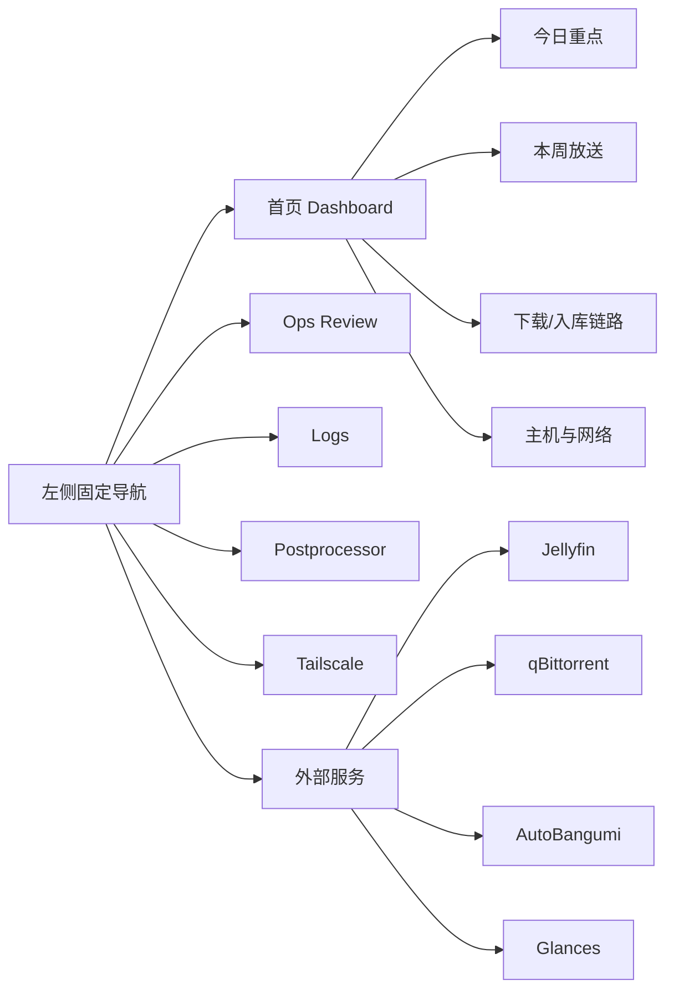

# Ops UI Redesign Spec

## 背景

`ops-ui` 现在已经具备完整功能：

- 首页总览
- 外部服务入口
- `Ops Review`
- `Logs`
- `Postprocessor`
- `Tailscale`
- 单服务重启 / 整套重启

但当前首页仍然更像“入口卡片集合”，而不是一个高信息密度的控制台。用户已经明确希望下一阶段做到：

- 把首屏 `8` 个服务入口从主内容区降级，考虑收进左侧固定导航
- 给右侧主工作区腾出更多空间
- 接更多真实业务信息，而不是只展示基础状态
- 提高视觉层级、操作直觉和整体信息密度
- 在开始实现这些之前，先写统一的 UI 设计语言、页面职责、实现约束和分阶段计划

这份 spec 的目标是确定下一阶段 `ops-ui` 的整体重构方向，而不是立即进入代码实现。

---

## 目标

### 功能目标

- 保留现有全部功能，不牺牲任何现有工作流
- 把首页从“服务入口页”重构成“控制台首页”
- 引入更适合追番场景的核心信息模块：
  - 今日更新
  - 本周放送表
  - 已更新 / 已下载 / 已入库状态
  - 下载链路与人工审核积压
- 让外部服务入口随时可达，但不再占据首页主要视觉层级
- 为中英文切换做结构准备

### 工程目标

- 继续保持轻量、快速、树莓派友好的前端形态
- 提升共享层和组件复用性，降低页面间重复逻辑
- 明确数据来源，避免首页逻辑继续堆在单页脚本里
- 为后续新增模块留出可插拔结构

### 体验目标

- 首屏在 1 次扫描内回答三个问题：
  - 今天有什么值得看
  - 下载和入库链路是否正常
  - 设备和远程访问是否健康
- 新用户第一次打开就能理解结构
- 老用户每天打开时能直达关键信息，不需要先点进各个外部服务

---

## 非目标

- 这一阶段不重写为 SPA
- 不引入 React / Vue / 大型图表框架
- 不在此阶段替换后端服务栈
- 不把 `ops-ui` 变成 Jellyfin / qB / AutoBangumi 的完整替代前端
- 不在此阶段完成多语言实现，只做结构准备

---

## 设计结论

### 推荐方案

采用**左侧固定导航 + 右侧主工作区**的控制台布局，并继续使用**轻量多页面应用（MPA）**架构。

#### 为什么选这个方案

- 它能把外部服务入口降级到“始终可访问但不抢主画面”
- 右侧能容纳更高密度的信息模块
- 保持现在“内部页站内导航、外部页新标签打开”的边界
- 相比 SPA，维护成本更低，性能更适合树莓派

## 视觉方向

### Visual Thesis

整体视觉从“暗色运维卡片板”转向“安静、紧凑、偏编辑式的控制台”：左侧是稳定导航，右侧是高信息密度但不过度拥挤的工作画布。

视觉方向必须同时覆盖浅色和深色两套主题，而不是只把其中一套做成主方案。

两套主题都需要满足：

- 安静，不花哨
- 高效，状态和结构一眼可读
- 有层次和立体感，但不过度装饰
- 重点信息突出，次级信息退后
- 相邻模块、状态和操作足够易区分

### Content Plan

- 第一屏：今日重点和控制台摘要
- 第二屏：放送与更新节奏
- 第三屏：下载、入库、审核和网络状态
- 内部工作页：按任务组织，不再重复首页入口区

### Interaction Thesis

- 外部服务入口始终在左侧，减少首页来回切换
- 首页模块之间允许卡片化，但不再让“入口卡片”主导界面
- 模块支持轻量刷新、局部状态提示和必要的趋势图
- 工作页优先直接解释“现在发生了什么”，不要求用户跨页面拼答案

---

## 信息架构

### 左侧固定导航

#### 分组

- `Dashboard`
- `Ops Review`
- `Logs`
- `Postprocessor`
- `Tailscale`

外部服务：

- `Jellyfin`
- `qBittorrent`
- `AutoBangumi`
- `Glances`

#### 导航项内容

每个导航项建议包含：

- 图标或字母缩写
- 名称
- 在线/异常状态点
- 必要时的小计数

例如：

- `Ops Review`：待审核文件数
- `Logs`：最近错误数
- `Postprocessor`：等待窗口或积压数

### 右侧首页主工作区

首页改成模块化布局，不再保留当前 `8` 张大入口卡。

推荐的首页结构：

#### 区块 1：今日重点

- 今日番剧更新摘要
- 今日高亮条目
- 今日是否有下载 / 入库 / 人工审核异常

#### 区块 2：放送与更新节奏

- 一周放送表
- 今日高亮列
- 本周已更新状态
- 可选：本周已下载 / 已入库状态叠加

#### 区块 3：链路状态

- 当前下载任务
- 等待窗口中的候选
- 今日新入库
- `manual_review` 积压

#### 区块 4：主机与网络

- CPU / 温度 / 风扇 duty
- 存储空间
- Tailscale 可达性
- 诊断与风险提示

---

## 数据来源与职责

### 结论

首页不应该把 `Jellyfin` 当成“追番更新状态”的唯一真相源。

### 各系统职责

#### AutoBangumi

适合提供：

- 订阅中的番剧列表
- 放送表
- 今日 / 本周更新候选
- 番剧名、封面、更新节奏

#### qBittorrent

适合提供：

- 当前下载任务
- 做种 / 排队 / 错误
- 下载速度和下载量

#### postprocessor

适合提供：

- 等待窗口
- 选优状态
- 已发布 / 已删落选
- `manual_review` 积压

#### Jellyfin

适合提供：

- 是否已入库
- 最近新增媒体
- 最近可播放条目
- 观看和播放侧状态

不适合负责：

- “是否订阅”
- “本周放送安排”

#### Tailscale / Glances / 宿主机

适合提供：

- 可达性
- peer 状态
- CPU / 温度 / 风扇 / 内存 / 网络

### 数据整合原则

首页的新模块统一由 `ops-ui` 后端聚合，不让前端直接拼多个外部 API。

也就是说：

- 前端只请求 `ops-ui` 自己的聚合接口
- `ops-ui` 后端负责：
  - 拉取外部服务
  - 清洗字段
  - 补齐统一状态
  - 输出适合前端直接渲染的数据结构

---

## 页面职责

### Dashboard

职责：

- 提供全局状态总览
- 成为日常打开的第一页面
- 聚焦“今天要看什么、现在哪里异常”

不再承担：

- 大块入口卡的展示

### Ops Review

职责：

- 人工审核列表
- 详情页
- 受控动作

下一阶段继续保持任务导向，不参与首页复杂汇总。

### Logs

职责：

- 查看结构化事件
- 按来源 / 等级 / 动作定位问题

后续可继续增强：

- 按来源分组
- 错误摘要
- 最近异常高亮

### Postprocessor

职责：

- 展示当前自动处理状态
- 辅助判断下载和发布链路是否正常

### Tailscale

职责：

- 展示本机与 peer 的 tailnet 状态
- 承载开 / 关动作与可达性诊断

---

## 工作页可理解性约束

`Ops Review`、`Logs`、`Postprocessor` 后续都必须做到“单页内可解释”。

目标是：

- 用户打开页面后，先看到结论，再看到明细
- 不需要跨页面来回跳转才能理解当前状态
- 不需要先读日志或手动比对多个列表，才能判断问题在哪里

### Ops Review

应优先回答：

- 现在有哪些文件需要人工处理
- 为什么会进审核
- 自动解析失败在哪一步
- 手动发布后会去哪里

### Logs

应优先回答：

- 最近到底发生了什么
- 哪一类服务在报错
- 错误是否持续，还是已经恢复

### Postprocessor

应优先回答：

- 当前处理链路是否健康
- 正在等什么
- 最近一轮具体发布了什么、删除了什么、失败了什么

这三个页面后续都应继续朝“状态摘要 + 当前上下文 + 最近动作”的结构收敛，而不是只堆列表或堆原始日志。

---

## UI 设计语言

### 颜色

- 保留当前的深浅双主题
- 主强调色继续使用 `teal`
- 风险和错误使用 `rose`
- 温度 / 警告使用 `amber`
- 避免继续增加新的强调色

### 排版

- 标题可以继续保留较强对比
- 次级说明尽量缩短，避免每个区块都像说明书
- 技术缩写保留英文：
  - `CPU`
  - `HOST`
  - `IPv4`
  - `Socket`
  - 服务名

### 卡片策略

- 首页继续允许卡片，但卡片只服务于“模块化信息块”
- 导航入口不再用大服务卡
- 内部页继续以 panel / section 为主，不再增加装饰性小卡

### 图表策略

- 趋势继续使用轻量折线与柱状图
- 适合增加：
  - 本周更新日历视图
  - 下载 / 入库柱状统计
  - 异常与积压的紧凑状态条
- 暂不引入大型图表库

---

## 实现约束

### 前端架构

继续使用 **MPA + 共享基础层**，不改为 SPA。

建议演进为：

- 共享 shell / layout
- 页面独立脚本
- 更明确的数据模块

### 模板结构

下一阶段应优先减少静态 HTML 的重复骨架。

推荐方向：

- 后端引入共享页面模板
- 或在当前静态页面基础上继续收敛重复头部与导航结构

目标：

- 页面标题区
- 导航
- 主题切换
- 顶部 meta

这些区域不再复制多份。

### 首页结构约束

- 首页不再继续增加大入口卡
- 外部服务入口收进左侧导航
- 首页主区域优先留给业务信息和控制台摘要
- 新增模块必须说明“它回答什么问题”，不能只因为“有数据”就放进首页

### 主题约束

- 浅色与深色都必须是完整主题，不允许一套认真设计、另一套只改变量
- 两套主题都要保持：
  - 清晰的区块层级
  - 一致的状态语义
  - 足够的文本与背景对比
  - 稳定的 hover / focus / active 反馈

### 工作页约束

- `Ops Review`、`Logs`、`Postprocessor` 页面内都必须提供摘要层
- 摘要层要先于明细层
- 用户不应依赖跨页跳转才能理解“当前发生了什么”

### 样式结构

当前仍使用单文件 `styles.css`，下一阶段开始允许拆层，但不要求第一步就全部拆完。

推荐顺序：

1. `tokens`
2. `base`
3. `layout`
4. `components`
5. `pages`

### 国际化准备

在做中英文切换前，先完成：

- 文案清单整理
- UI 术语统一
- 页面级文案抽离边界确定

这一阶段不要求立即实现多语言。

---

## 性能约束

- 首屏继续保留骨架屏
- 使用局部缓存提升返回速度
- 自动刷新要继续避开用户输入
- 所有新增模块优先服务端聚合，不把复杂计算塞到浏览器
- 页面目标仍然是“树莓派可承受、不同网络下迅速打开”

---

## 分阶段计划

### Phase 1：设计语言与结构准备

- 写本 spec
- 明确页面职责
- 确定首页模块清单
- 确定数据来源分工

### Phase 2：代码层拆解整理

- 继续收敛共享前端基础层
- 开始处理共享页面 shell
- 梳理文案和 i18n 边界
- 视情况拆分样式文件

### Phase 3：首页重构

- 左侧固定导航
- 右侧主工作区
- 首页从入口页改成控制台首页

### Phase 4：新增业务模块

- 放送表
- 今日高亮
- 本周更新状态
- 已下载 / 已入库叠加

### Phase 5：全站语言切换与精修

- 中英切换
- 文案统一
- 微交互和视觉 polish

---

## 风险与注意点

### 风险 1：数据源职责混乱

如果首页既让 `AutoBangumi` 给放送表，又让 `Jellyfin` 决定是否订阅，就会很快变乱。

解决：

- 明确“订阅与放送节奏”由 `AutoBangumi` 主导
- `Jellyfin` 只补入库与可播放状态

### 风险 2：首页继续卡片膨胀

如果只是把更多信息继续塞进卡片网格，布局不会真的进化。

解决：

- 先改结构，再加模块

### 风险 3：代码先拆后改布局，返工

如果现在先纯做代码拆分，后面左导航和首页模块化上线时，还会再改一轮。

解决：

- 先确认本 spec，再开始 Phase 2

---

## 最终结论

下一步的正确顺序是：

1. 先确认这份 `ops-ui` 重构 spec  
2. 再做代码层拆解整理  
3. 然后进入首页大改版和新模块接入  

不建议跳过 spec 直接拆代码，也不建议继续在当前首页上累加更多卡片和图表。
